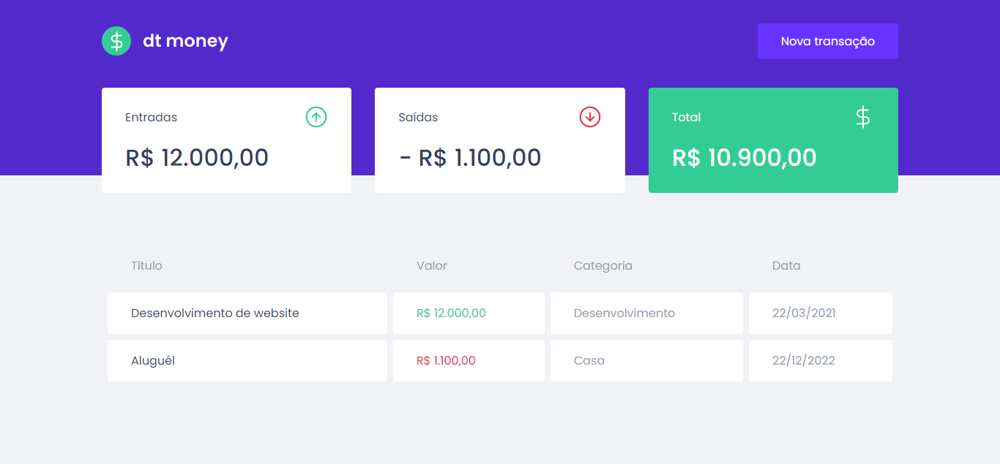
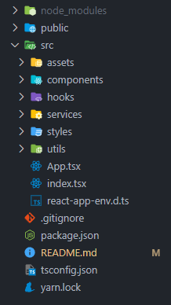
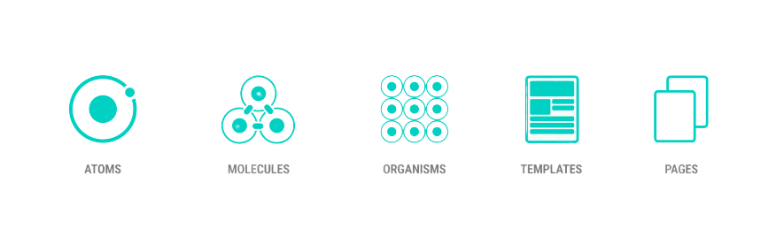
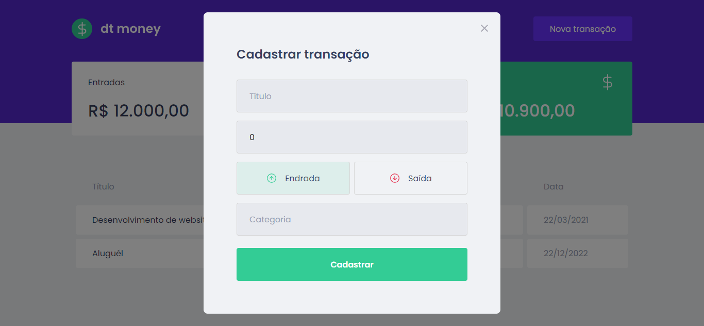

# dtmoney 💸



## ⚠️- Creating new transactions is broken until the backend is developed - [Check Project](https://dtmoney-phi-inky.vercel.app/)

dtmoney is an application for personal financial control. It was [designed](<https://www.figma.com/file/0xmu9mj2TJYoIOubBFWsk5/dtmoney-Ignite-(Copy)>) by the [Rocketseat](https://www.rocketseat.com.br/) team and developed by me during my participation in the Ignite course.

During the development of the project, several concepts were addressed that are fundamental in the daily life of a Frontend professional, among which I highlight:

## [Structure of a Real Application 🏗️](#structure-of-a-real-application)

I saw how the hierarchy and basic architecture of a Frontend project works. How the files and directories that make up a modern app are organized.



I also saw a really cool way to apply global styles through the styled component

```JavaScript
export const GlobalStyle = createGlobalStyle`
  // Global Style variables
  :root {
    --red: #e52e4d;
    --blue: #5429cc;
    --green: #33cc95;

    --blue-light: #6933ff;

    --text-title: #363f5f;
    --text-body: #969cb3;

    --background: #f0f2f5;
    --shape: #ffffff;
    /* --white: #ffffff; */
  }

  * {
    margin: 0;
    padding: 0;
    box-sizing: border-box;
  }

  // Responsive font-size hack:
  html {
    @media (max-width: 1080px) {
      font-size: 93.75%;
    }

    @media (max-width: 720px) {
      font-size: 87.5%;
    }
  }

  body {
    background-color: var(--background);
    -webkit-font-smoothing: antialiased;
  }

  body, input, textarea, button {
    font-family: 'Poppins', sans-serif;
    font-weight: 400;
  }

  h1, h2, h3, h4, h5, h6, strong {
    font-weight: 600;
  }

  button {
    cursor: pointer;
  }

  [disabled] {
    opacity: 0.6;
    cursor: not-allowed;
  }
}
```

## [Componentization 🍰](#componentization)

The componentization of a part of the layout or functionality consists of separating each part with its respective function, in order to improve the maintenance and semantics of the code.



## API Consumption

Another point addressed was the consumption of APIS coming from the Backend during the implementation of the Frontend. Often these APIs are not ready to use, which can stall development or require the developer to use static data.

From this, there are ways to create a kind of fake Backend, which provides the possibility to make http requests and manipulate data in a completely fictitious way. Some tools that I highlight for this work are:

- [JSON Server](https://github.com/typicode/json-server)
- [MirageJS](https://miragejs.com/)
- [MSW](https://mswjs.io/)

> In this project the mirage JS was used. :smile:

```JavaScript
createServer({
  seeds(server) {
    server.db.loadData({
      transactions: [
        {
          id: 1,
          title: "Desenvolvimento de website",
          amount: 12000,
          category: "Desenvolvimento",
          type: "deposit",
          createdAt: new Date("2021-03-23"),
        },
        {
          id: 2,
          title: "Aluguél",
          amount: 1100,
          category: "Casa",
          type: "withdraw",
          createdAt: new Date("2022-12-23"),
        },
      ],
    });
  },
  models: {
    transaction: Model,
  },
  routes() {
    this.namespace = "api";
    this.get("/transactions", () => {
      return this.schema.all("transaction");
    });
    this.post("/transactions", (schema, request) => {
      const data = JSON.parse(request.requestBody);

      return schema.create("transaction", { ...data, createdAt: new Date() });
    });
  },
});
```

Another interesting point was the creation of a single dummy API projectinstance using Axios.

```JavaScript
export const api = axios.create({
  baseURL: "http://localhost:3000/api",
  headers: {
    "Content-Type": "application/json",
  },
});
```

## Modal & Forms

To create the modal I used an already existing package called [react-modal](https://www.npmjs.com/package/react-modal).



## Context and Custom Hooks

To share data between various components of the application, avoiding the bad practice of prop drill, the react context API was used, where finally created a custom hook, `useTransactions` to retrieve our data.
